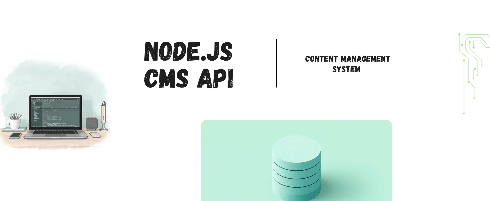

# 📝 Node.js CMS - Content Management System

A full-featured Content Management System built with Node.js, Express, and MySQL. This project demonstrates RESTful API development with authentication, authorization, and CRUD operations.


## ✨ Features

- **🔐 Authentication & Authorization**
  - JWT-based authentication
  - Protected routes with middleware
  - User registration and login
- **📄 Posts Management**
  - Create, read, update, and delete posts
  - Public posts feed
  - User-specific posts
- **🗂️ Categories System**
  - Organize posts into categories
  - Full CRUD operations
- **👤 User Profiles**
  - View and update user profiles
  - Secure password handling

## 🛠️ Tech Stack

- **Backend:** Node.js, Express.js
- **Database:** MySQL
- **Authentication:** JWT, bcryptjs
- **Security:** CORS, environment variables
- **Architecture:** MVC pattern

## 📋 API Endpoints

### Authentication
- `POST /api/auth/register` - User registration
- `POST /api/auth/login` - User login

### Posts
- `GET /api/posts` - Get all posts (Public)
- `GET /api/posts/my-posts` - Get user's posts (Protected)
- `GET /api/posts/:id` - Get single post
- `POST /api/posts` - Create new post (Protected)
- `PUT /api/posts/:id` - Update post (Protected)
- `DELETE /api/posts/:id` - Delete post (Protected)

### Categories
- `GET /api/categories` - Get all categories
- `POST /api/categories` - Create category
- `PUT /api/categories/:id` - Update category
- `DELETE /api/categories/:id` - Delete category

### Users
- `GET /api/users/profile` - Get user profile (Protected)
- `PUT /api/users/profile` - Update profile (Protected)

## 🚀 Installation

1. **Clone the repository**
```bash
git clone https://github.com/Pmahdian/Nodejs-cms.git
cd nodejs-cms
```

2. **Install dependencies**
```bash
npm install
```

3. **Set up environment variables**
```bash
cp .env.example .env
# Edit .env with your database credentials
```

4. **Database setup**
```sql
CREATE DATABASE cms_database;
```

5. **Run the application**
```bash
npm start
```


## 📁 Project Structure

```
Nodejs-cms/
│
├── 📁 src/
│   ├── 📁 config/
│   │   └── database.js              # MySQL database configuration
│   │
│   ├── 📁 controllers/
│   │   ├── authController.js        # Authentication logic (register/login)
│   │   ├── postController.js        # Posts CRUD operations
│   │   ├── categoryController.js    # Categories management
│   │   └── userController.js        # User profile management
│   │
│   ├── 📁 middleware/
│   │   └── authMiddleware.js        # JWT authentication middleware
│   │
│   ├── 📁 routes/
│   │   ├── auth.js                  # /api/auth/* routes
│   │   ├── posts.js                 # /api/posts/* routes
│   │   ├── categories.js            # /api/categories/* routes
│   │   └── users.js                 # /api/users/* routes
│   │
│   └── server.js                    # Main server file
│
├── 📄 .env                          # Environment variables (sensitive)
├── 📄 .env.example                  # Environment variables template
├── 📄 .gitignore                    # Git ignored files
├── 📄 package.json                  # Project dependencies
├── 📄 README.md                     # Project documentation
└── 📄 LICENSE                       # Project license
```

## 🗃️ Database Schema

```
📊 cms_database/
├── 👥 users table
│   ├── id (PRIMARY KEY)
│   ├── username
│   ├── email
│   ├── password (hashed)
│   └── created_at
│
├── 📝 posts table
│   ├── id (PRIMARY KEY)
│   ├── title
│   ├── content
│   ├── user_id (FOREIGN KEY → users.id)
│   ├── category_id (FOREIGN KEY → categories.id)
│   ├── created_at
│   └── updated_at
│
└── 🗂️ categories table
    ├── id (PRIMARY KEY)
    ├── name
    ├── description
    └── created_at
```

## 🔗 Dependencies

```json
{
  "dependencies": {
    "express": "^4.18.2",
    "mysql2": "^3.6.5", 
    "bcryptjs": "^2.4.3",
    "jsonwebtoken": "^9.0.2",
    "dotenv": "^16.3.1",
    "cors": "^2.8.5"
  }
}
```

## 🔧 Configuration

Create a `.env` file with the following variables:
```env
DB_HOST=localhost
DB_USER=your_username
DB_PASS=your_password
DB_NAME=cms_database
JWT_SECRET=your_jwt_secret
APP_PORT=3000
```

## 🤝 Contributing
Feel free to fork this project and submit pull requests for any improvements.

## ✉️ Contact Developer
- Parnian Mahdian
- [Email](mahdianparnian@yahoo.com)
- [GitHub Profile](https://github.com/Pmahdian)

## 📄 License
This project is open source and available under the [MIT License](LICENSE).

---

**⭐ Don't forget to star this repository if you find it useful!**


```
Nodejs-cms
├─ LICENSE
├─ README.md
├─ cms-Banner.png
├─ package-lock.json
├─ package.json
├─ server.js
├─ src
│  ├─ README.md
│  ├─ config
│  │  ├─ config.json
│  │  └─ sequelize.js
│  ├─ controllers
│  │  ├─ authController.js
│  │  ├─ categoryController.js
│  │  ├─ commentController.js
│  │  ├─ postController.js
│  │  ├─ testController.js
│  │  ├─ uploadController.js
│  │  └─ userController.js
│  ├─ middleware
│  │  ├─ authMiddleware.js
│  │  └─ validationMiddleware.js
│  ├─ models
│  │  ├─ Category.js
│  │  ├─ Comment.js
│  │  ├─ Post.js
│  │  ├─ User.js
│  │  └─ associations.js
│  ├─ routes
│  │  ├─ auth.js
│  │  ├─ categories.js
│  │  ├─ comments.js
│  │  ├─ posts.js
│  │  ├─ upload.js
│  │  └─ users.js
│  └─ validators
│     ├─ authValidator.js
│     ├─ categoryValidator.js
│     ├─ commentValidator.js
│     ├─ postValidator.js
│     └─ userValidator.js
└─ sync-comments.js

```